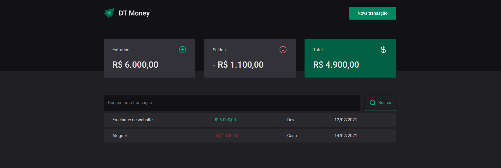
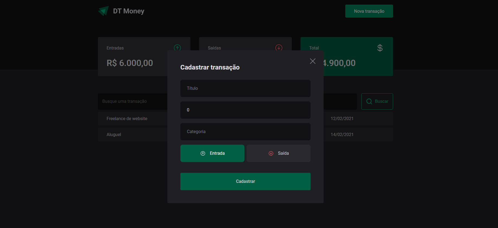

# DT Money

DT Money é uma solução prática e eficiente para o gerenciamento de suas finanças pessoais no dia a dia. 

Com ele, você pode facilmente registrar e acompanhar todas as suas transações financeiras, incluindo despesas e receitas, com detalhes de quanto, quando e em que você gastou ou recebeu dinheiro.


## Veja esse projeto online

[DtMoney no netlify](https://awesomeopensource.com/project/elangosundar/awesome-README-templates)


## Rodando localmente

Clone o projeto

```bash
  git clone https://github.com/IsraelBarbosa/dt-money.git
```

Entre no diretório do projeto

```bash
  cd dt-money
```

Instale as dependências

```bash
  npm install
```

Inicie o servidor

```bash
  npm run start
```


## Stack utilizada

* React
* TypeScript
* styled-components


## Aprendizados

* React com typeScript
* Utilizar o context api
* Utilizar um hook customizado
* Utilizar o axios
* Api mocking com o miragejs
* Utilizar o styled-components
* Uso da unidade de medida REM


## Funcionalidades

- Com ele, você pode facilmente registrar e acompanhar todas as suas transações financeiras, incluindo despesas e receitas, com detalhes de quanto, quando e em que você gastou ou recebeu dinheiro


## Screenshots




